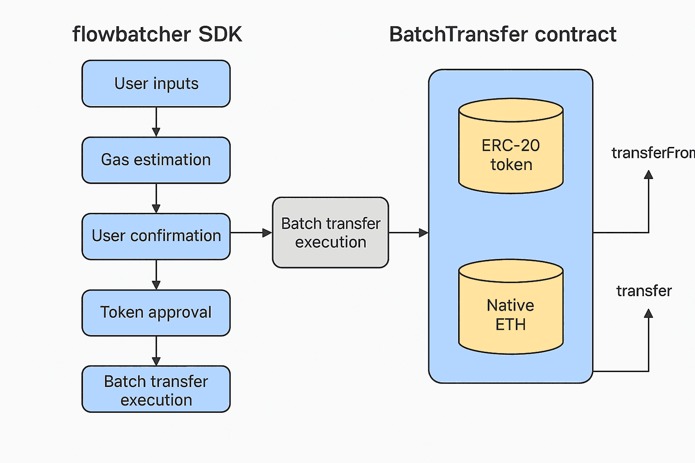

# flowBatcher SDK

## Overview

This SDK simplifies the process of transferring ERC-20 tokens and native Ethereum (ETH) to multiple recipients in a single transaction. By bundling transactions, it helps save on gas fees and improves transaction efficiency.

## Getting Started

### Installation

To use the Ethereum Batch Transfer SDK, follow these steps:

#### **Clone the Repository:**

```bash
git clone https://github.com/your-username/ethereum-batch-transfer-sdk.git
cd flowBatcher
```

#### **Install Dependencies:**

```bash
npm install
```

#### **Set up Environment Variables:**

Create a `.env` file in the root of the project with your Ethereum node URL and wallet private key:

```plaintext
ETH_NODE_URL=https://your-ethereum-node-url
WALLET_PRIVATE_KEY=your-private-key
```

## Problem Statement

Transferring tokens or native Ethereum (ETH) to multiple addresses is often inefficient and costly, especially when multiple transactions incur separate gas fees. This SDK optimizes the process by allowing batch transfers of tokens and ETH in a single operation, making it more cost-effective and convenient.



## System Flow

1. **User Inputs**: The user provides recipient addresses and amounts of ERC-20 tokens or ETH.
2. **Gas Estimation**: The SDK estimates the gas fees required for the batch transfer and notifies the user of the estimated cost in both ETH and USD.
3. **User Confirmation**: The user is prompted for confirmation to proceed with the batch transfer.
4. **Token Approval**: For ERC-20 tokens, the SDK calls the `approve` method to allow the contract to transfer tokens on behalf of the user.
5. **Batch Transfer Execution**: The SDK sends the batch transfer of ERC-20 tokens or ETH to all recipients in one transaction.

## Features

- **Batch Transfer of ERC-20 Tokens**: Send ERC-20 tokens to multiple recipients with one transaction.
- **Batch Transfer of Native Ethereum (ETH)**: Transfer ETH to multiple addresses with a single transaction.
- **Gas Estimation**: Calculate the gas required for the batch transfer.
- **User Interaction**: Confirm the transfer before executing to ensure control over large transactions.
- **Cross-platform Support**: Works with both ERC-20 tokens and native Ethereum (ETH).

## Security Enhancements

### **Reentrancy Guard**

- Implemented `ReentrancyGuard` from OpenZeppelin to prevent **reentrancy attacks**, especially for native Ether transfers.
- The `nonReentrant` modifier ensures the batch transfer function cannot be called recursively, protecting against vulnerabilities.

### **ETH Transfer Validation**

- The contract verifies that the total **Ether sent (`msg.value`) matches the expected sum** of amounts.
- If the user sends more or less ETH than required, the transaction is **reverted** to prevent errors or fund loss.

## Efficiency Enhancements

### **Optimized Token Transfer**

- Instead of using `transferFrom` (which requires prior approval), the contract **uses `transfer` when the contract itself is the sender**, reducing gas costs.
- `IERC20(token).transferFrom(msg.sender, recipients[i], amounts[i]);` was changed to `token.transferFrom(msg.sender, recipients[i], amounts[i]);`.

### **Helper Function (sumAmounts)**

- A helper function, `sumAmounts`, efficiently calculates the total ETH amount in the batch transfer.
- **Avoids redundant computations** in the main function, reducing gas consumption.

### **Gas Optimization**

- By **precomputing the sum of amounts** in the `sumAmounts` helper function, unnecessary operations in the main loop are avoided, **enhancing efficiency**.

## Functionality

## `batchTransferERC20(recipients, amounts)`

Transfers ERC-20 tokens to multiple recipients in a single transaction.

#### Parameters:

- `recipients`: Array of recipient addresses.
- `amounts`: Array of amounts to send to each recipient.

##### Response:

- **Success**: Returns the transaction hash and logs completion.
- **Error**: Throws an error if invalid recipients or amounts are provided.

#### Example:

```javascript
const recipients = ["0xRecipient1", "0xRecipient2"]
const amounts = [10, 5]
await sdk.batchTransferERC20(recipients, amounts)
```

#### Response Sample

```javascript
{
  date: '4/4/2025, 2:53:07 AM',
          message: '🚨 GAS FEE ESTIMATE FOR Eth BATCH TRANSFER: \n' +
  '         - Estimated Gas: 71857  \n' +
  '         - Gas Price (gwei): 0.01444276\n' +
  '          - Estimated Cost (ETH): 0.00000103781340532\n' +
  '           - Estimated Cost (USD): 0.001869465177673182',
          data: {}
}

Proceed with Eth Batch Transfer? (yes/no):
```

## `batchTransferNative(recipients, amounts)`

Transfers native ETH to multiple recipients in one batch transaction.

#### Parameters:

- `recipients`: Array of recipient addresses.
- `amounts`: Array of amounts of ETH to send to each recipient.

#### Response:

- **Success**: Returns the transaction hash and logs completion.
- **Error**: Throws an error if the recipient list or amounts are invalid.

#### Example:

```javascript
const recipients = ["0xRecipient1", "0xRecipient2"]
const amounts = [0.1, 0.2]
await sdk.batchTransferNative(recipients, amounts)
```

## `estimateGasFees(recipients, amounts, tokenAddress, isNative)`

Estimates the gas fees for the batch transfer of ERC-20 tokens or native ETH.

#### Parameters:

- `recipients`: Array of recipient addresses.
- `amounts`: Array of amounts to transfer.
- `tokenAddress`: The ERC-20 token address (use `ethers.ZeroAddress` for ETH).
- `isNative`: Boolean to specify if the transfer is native ETH.

##### Response:

- **Success**: Returns the estimated gas, gas price, and cost in both ETH and USD.
- **Error**: Throws an error if gas estimation fails.

#### Response Sample

```javascript
{
  date: '4/4/2025, 2:53:07 AM',
          message: '🚨 GAS FEE ESTIMATE FOR ERC-20 BATCH TRANSFER: \n' +
  '         - Estimated Gas: 71857  \n' +
  '         - Gas Price (gwei): 0.01444276\n' +
  '          - Estimated Cost (ETH): 0.00000103781340532\n' +
  '           - Estimated Cost (USD): 0.001869465177673182',
          data: {}
}

Proceed with ERC-20 Batch Transfer? (yes/no):
```

## Example Usage

```javascript
require("dotenv").config({ path: "./.env" })
const { createProviderAndSigner } = require("./src/lib/ethers.lib.src")
const SDK = require("./src/sdk")
const config = require("./src/config")
const validatorsUtil = require("./src/utils/validators.utils")

const { provider, signer } = createProviderAndSigner(
  process.env.ETH_NODE_URL,
  process.env.WALLET_PRIVATE_KEY,
)

const sdk = new SDK(provider, signer, config)

;(async () => {
  try {
    const recipients = [
      "0x93297d48A40446dc84a388BB94F3A1247CB74870",
      "0x50da5C365a08169A9101C1969492540dA937071F",
    ]
    const amounts = [1, 2]
    await sdk.batchTransferERC20(recipients, amounts)
  } catch (error) {
    throw error
  }
})()
```

## Function Responses

### `batchTransferERC20(recipients, amounts)`

#### **Success:**

```json
{
  "txHash": "0xFakeTxHash",
  "message": "✅ ERC-20 Batch Transfer completed!"
}
```

#### **Error:**

```json
{
  "error": "Invalid recipients or amounts"
}
```

## Coding Practices

- **Modular Code Structure**: The SDK follows a modular architecture for easy debugging and scalability.
- **Code Linting**: Uses `eslint` with strict rules (`--max-warnings=0`) to enforce clean code.
- **Prettier Formatting**: Ensures consistent code styling using `prettier . --write`.
- **Error Handling**: Implements proper error handling with `try-catch` blocks to prevent unexpected failures.
- **Unit Testing**: Uses Mocha and Chai for comprehensive test coverage.

## Coding Standards & Dependencies

- **Coding Standards**:
  - Uses modern JavaScript (ES6+).
  - Consistent naming conventions (`camelCase` for variables).
  - Modular functions for improved maintainability.
- **Key Dependencies**:
  - `ethers`: Used for blockchain interactions.
  - `axios`: HTTP client for API calls.
  - `eslint`, `prettier`: Code quality tools.
  - `mocha`, `chai`, `sinon`: Testing libraries.
  - `dotenv`: Manages environment variables.
  -

## License

This SDK is open-source and available under the MIT License.
